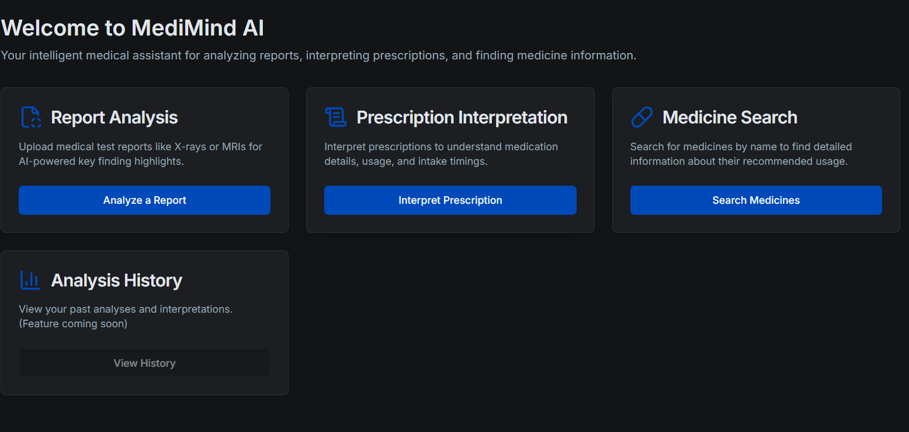

<<<<<<< HEAD
# 🧠 MEDIMIND-AI

 <!-- Replace with actual image path or URL -->

## 🩺 Project Description

**MEDIMIND-AI** is a cutting-edge web application built to provide users with intelligent and accessible tools for navigating their personal health data.

By harnessing the power of **Artificial Intelligence (AI)** and **Natural Language Processing (NLP)**, MEDIMIND-AI simplifies the complex and often overwhelming task of interpreting medical reports, prescriptions, and medicine information. The application is designed to **empower individuals** in managing their health with **clarity, reliability, and security**.

🔒 Your data privacy is our top priority — all health data is handled with the highest confidentiality standards.

---

## ✨ Features

- 📄 **Medical Report Analysis**  
  Upload medical reports and receive AI-generated summaries and insights into key findings.

- 💊 **Prescription Interpretation**  
  Get simplified explanations of prescription details, including dosage, schedule, and possible side effects.

- 🔍 **Medicine Search**  
  Search for reliable information about various medicines — including uses, interactions, and risks.

- 🖥️ **User-Friendly Interface**  
  A clean, responsive, and intuitive interface for a seamless experience.

- 🔐 **Secure Data Handling**  
  Ensures safe processing and storage of sensitive medical information.

---

## 🛠️ Technologies Used

- **Next.js** — React framework for SSR and SSG.
- **TypeScript** — Strongly-typed JavaScript for safer and scalable development.
- **Tailwind CSS** — Utility-first CSS framework for fast UI design.
- **Firebase** — Used for:  
  - 🔐 Authentication  
  - 📦 Firestore (database)  
  - ☁️ Cloud Functions (AI processing endpoints, if applicable)
- **GenKit** (Optional) — Used for integrating GenAI models (e.g., report summarization or prescription interpretation).
- **shadcn/ui** — Prebuilt accessible UI components based on Radix UI + Tailwind CSS.

---

## 🚀 Installation

### Clone the repository
git clone https://github.com/kapayashwanth/MEDIMIND-AI.git

### Navigate into the project directory
cd MEDIMIND-AI

### Install dependencies
npm install

### Run the development server
npm run dev
=======
**`/README.md`**

# MEDIMIND-AI

## Project Description

MEDIMIND-AI is a cutting-edge web application built to provide users with intelligent and accessible tools for navigating their personal health data. By harnessing the power of artificial intelligence and natural language processing, MEDIMIND-AI simplifies the often complex and daunting task of understanding medical reports, prescriptions, and general medicine information. Our goal is to empower individuals to take a more active role in managing their health by providing clear, concise, and reliable information. The application is designed with a focus on user privacy and data security, ensuring your sensitive health information is handled with the highest standards of confidentiality.

The core functionalities revolve around three key areas: AI-powered analysis of medical reports to extract and summarize critical findings, intelligent interpretation of complex prescription details into easily understandable instructions, and a comprehensive search engine for reliable information on various medications.

## Features

- **Medical Report Analysis:** Upload and analyze your medical reports to gain insights into key findings and potential implications.
- **Prescription Interpretation:** Get clear and understandable interpretations of your prescriptions, including dosage, frequency, and potential side effects.
- **Medicine Search:** Easily search for information about various medicines, including uses, side effects, and interactions.
- **User-Friendly Interface:** An intuitive and responsive interface for a seamless user experience.
- **Secure Data Handling:** Your health information is handled with the utmost care and security.

## Technologies Used

- **Next.js:** A React framework for building server-side rendered and statically generated web applications.
- **TypeScript:** A typed superset of JavaScript that compiles to plain JavaScript.
- **Tailwind CSS:** A utility-first CSS framework for rapid UI development.
- **Firebase:** A platform for building web and mobile applications, used here potentially for backend services, authentication, or data storage. (Specify which Firebase services are used if known, e.g., Authentication, Firestore, Cloud Functions).
- **GenKit:** (If applicable) Specify how GenKit is used, e.g., for AI model integration.
- **Shadcn/ui:** (If applicable) A collection of re-usable components built using Radix UI and Tailwind CSS.

## Installation

1. **Clone the repository:**

>>>>>>> fbe50f6 (i need black and red theme)
